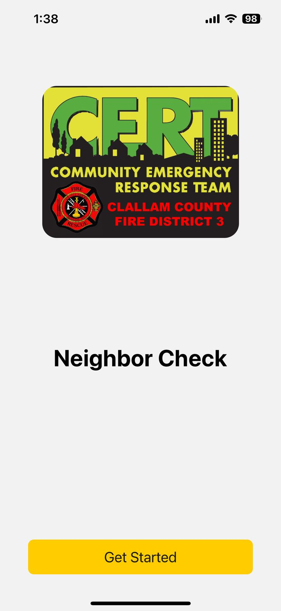
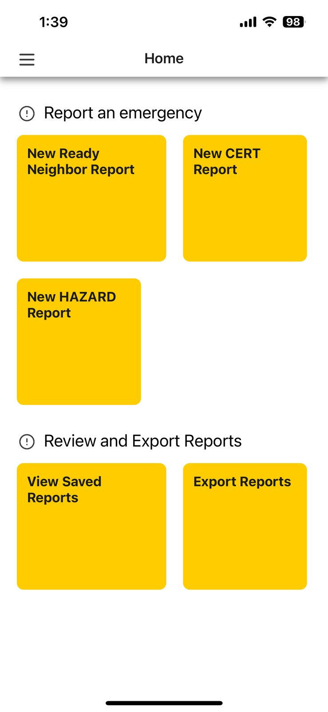
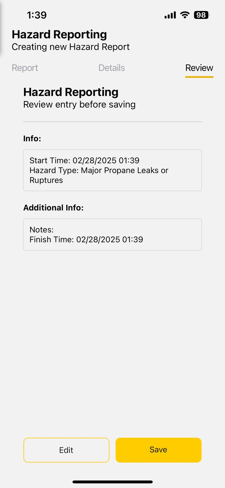

# EmergencyDataCollectionApp

## Project Title and Description

**EmergencyDataCollectionApp** is a mobile application designed to assist READY NEIGHBOR groups, CERT search and rescue teams, and public sector workers in gathering critical information for Emergency Operations Centers immediately after a major disaster. The app is divided into sections tailored to specific activities, such as READY NEIGHBOR, CERT, and public sector hazard reporting.

## Demo/Screenshots

<div style="display: flex; justify-content: space-between; flex-wrap: wrap;">
  
  
  
</div>

## Tech Stack

- **Frontend:** React Native, Expo
- **Backend:** Node.js, Express
- **State Management:** Jotai
- **UI Components:** NativeBase, Gluestack UI
- **Database:** SQLite (via expo-sqlite)
- **Testing:** Jest, @testing-library/react-native

## Installation and Setup


1. **Clone the repository:**
   ```sh
   git clone https://github.com/yourusername/EmergencyDataCollectionApp.git
   cd EmergencyDataCollectionApp

2. **Install dependencies:**
   ```sh
   npm install

3. **Start the development server:**
   ```sh
   npx expo start

4. **Run the application:**
   ```sh 
    - For Android:
    npm run android
    - For iOS:
    npm run ios
    - For Web:
    npm run web

## Usage

1. **Welcome Screen:** The initial screen where users can get started with the app.
Main Menu: Provides options to start new reports, view saved reports, and access settings.

2. **Report Forms:** Users can fill out various forms to report incidents, hazards, and other critical information.
3. **Export Reports:** Users can export reports as CSV files and share them via email or other means.

## Architecture/Design Pattern
The application follows a modular architecture with a clear separation of concerns:

- **Components:** Reusable UI components located in the src/components directory.

- **Screens:** Individual screens for different parts of the app located in the src/screens directory.
Navigation: Navigation setup using React Navigation located in the src/navigation directory.

- **State Management:** Managed using Jotai atoms located in the src/atoms directory.
Utilities: Helper functions and constants located in the src/utils directory.

- **Backend:** Node.js and Express for handling API requests and server-side logic.

## Workflows and Testing

- **CI/CD:** GitHub Actions workflows for testing and linting located in the .github/workflows directory.

- **Testing:** Unit and integration tests using Jest and @testing-library/react-native. Test files are located alongside the components and screens they test.

## Contact Information
For any inquiries or support, please contact:

Sahil Parwani: sparwan1@asu.edu
