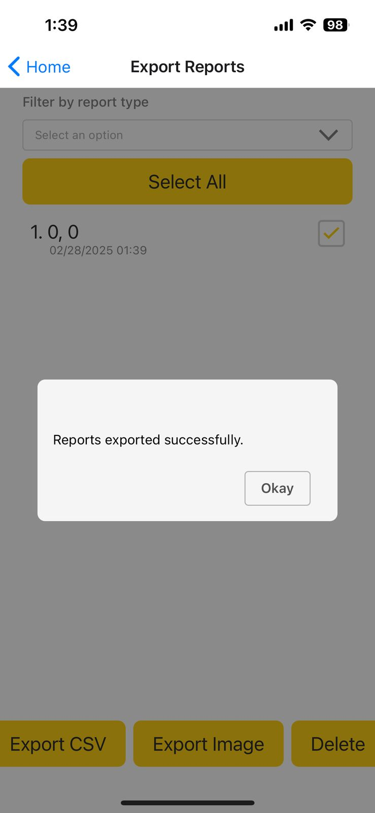

# EmergencyDataCollectionApp

## Project Title and Description

**EmergencyDataCollectionApp** is a mobile application designed to assist READY NEIGHBOR groups, CERT search and rescue teams, and public sector workers in gathering critical information for Emergency Operations Centers immediately after a major disaster. The app is divided into sections tailored to specific activities, such as READY NEIGHBOR, CERT, and public sector hazard reporting.

## Demo/Screenshots

<div style="display: flex; justify-content: space-between; flex-wrap: wrap;">
  
  
  
  
</div>

## Tech Stack

- **Frontend Framework:**
  - React Native: The core mobile framework for cross-platform development
  - Expo: Used for simplified React Native development and deployment
- **UI Libraries:**
  - NativeBase: UI component library providing pre-built components
  - Gluestack UI: Modern UI component library with theming capabilities
  - React Native Elements: Used for specific components like MultiSelect
  - Galio Framework: Used for additional UI components
- **Navigation:**
  - React Navigation: Including Stack, Drawer, and Tab navigators
  - React Native Tab View: For tab-based navigation in report screens
- **State Management:**
  - Jotai: Atomic state management library for React
  - AsyncStorage: For persistent local storage
- **Database:**
  - SQLite (expo-sqlite): Local database for storing reports offline
- **Device Features:**
  - expo-location: Accessing device GPS
  - expo-camera: Camera functionality
  - expo-image-picker: For selecting images from the gallery
  - expo-file-system: For file operations
  - expo-media-library: For accessing and saving to the device's media library
  - expo-sharing: For sharing files externally
- **Testing:**
  - Jest: Testing framework
  - @testing-library/react-native: For testing React components
- **Development Tools:**
  - ESLint: For code linting with universe/native configuration
  - Babel: For JavaScript transpilation
  - Prettier: For code formatting
  - Patch Package: For patching dependencies
- **Build/Deployment:**
  - EAS (Expo Application Services): For building and publishing the app
  - expo-splash-screen: For customizing the app's splash screen
## Installation and Setup


1. **Clone the repository:**
   ```sh
   git clone https://github.com/yourusername/EmergencyDataCollectionApp.git
   cd EmergencyDataCollectionApp

2. **Install dependencies:**
   ```sh
   npm install

3. **Start the development server:**
   ```sh
   npx expo start

4. **Run the application:**
   ```sh 
    - For Android:
    npm run android
    - For iOS:
    npm run ios
    - For Web:
    npm run web

## Usage

1. **Welcome Screen:** The initial screen where users can get started with the app.
Main Menu: Provides options to start new reports, view saved reports, and access settings.

2. **Report Forms:** Users can fill out various forms to report incidents, hazards, and other critical information.
3. **Export Reports:** Users can export reports as CSV files and share them via email or other means.

## Architecture/Design Pattern
The application follows a modular architecture with a clear separation of concerns:

- **Components:** Reusable UI components located in the src/components directory.

- **Screens:** Individual screens for different parts of the app located in the src/screens directory.
Navigation: Navigation setup using React Navigation located in the src/navigation directory.

- **State Management:** Managed using Jotai atoms located in the src/atoms directory.
Utilities: Helper functions and constants located in the src/utils directory.


## Workflows and Testing

- **CI/CD:** GitHub Actions workflows for testing and linting located in the .github/workflows directory.

- **Testing:** Unit and integration tests using Jest and @testing-library/react-native. Test files are located alongside the components and screens they test.

## Contact Information
For any inquiries or support, please contact:

Sahil Parwani: sparwan1@asu.edu
